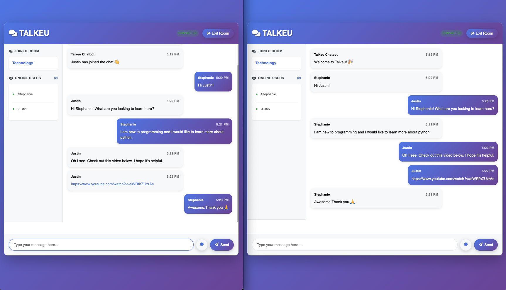

# Talkeu - Modern Real-time Chat Application

A modern, secure, and feature-rich real-time chat application built with Node.js, Express, and Socket.IO.

## Features

### Core Features
- **Real-time messaging** with instant message delivery
- **Room-based chat** with multiple themed rooms
- **User presence** with online/offline indicators
- **Typing indicators** to show when users are typing
- **Message formatting** with emoji support and clickable links

### Security & Performance
- **Input validation** and sanitization to prevent XSS attacks
- **Rate limiting** to prevent spam and abuse
- **Helmet.js** for security headers
- **CORS** support for cross-origin requests
- **Error handling** with comprehensive logging

### User Experience
- **Modern UI** with gradient backgrounds and smooth animations
- **Responsive design** that works on all devices
- **Accessibility features** with ARIA labels and keyboard navigation
- **Connection status** indicators
- **Notification system** for errors and events
- **Keyboard shortcuts** (Ctrl+Enter to send, Escape to clear)

### Technical Improvements
- **Updated dependencies** to latest stable versions
- **Better error handling** throughout the application
- **Code organization** with modular utilities
- **Performance optimizations** with efficient DOM updates

## Live Demo

Visit: https://talkeu-production.up.railway.app

## Screenshots




## Installation & Setup

### Prerequisites
- Node.js (version 14 or higher)
- npm or yarn

### Local Development

1. **Clone the repository**
   ```bash
   git clone <repository-url>
   cd Talkeu
   ```

2. **Install dependencies**
   ```bash
   npm install
   ```

3. **Start the development server**
   ```bash
   npm run dev
   ```

4. **Open your browser**
   Navigate to `http://localhost:3000`

### Production Deployment

1. **Install dependencies**
   ```bash
   npm install --production
   ```

2. **Start the server**
   ```bash
   npm start
   ```

## Project Structure

```
Talkeu/
├── public/
│   ├── css/
│   │   └── style.css          # Enhanced styling with modern design
│   ├── js/
│   │   └── main.js            # Client-side logic with new features
│   ├── images/                # Application screenshots
│   ├── index.html             # Welcome page with validation
│   └── chat.html              # Chat interface with accessibility
├── utils/
│   ├── messages.js            # Message formatting utilities
│   └── users.js               # User management with validation
├── server.js                  # Enhanced server with security
├── package.json               # Updated dependencies
└── README.md                  # This file
```

## Configuration

### Environment Variables
- `PORT`: Server port (default: 3000)
- `NODE_ENV`: Environment mode (development/production)

### Security Features
- **Rate Limiting**: 100 requests per 15 minutes per IP
- **Input Validation**: Username and message length limits
- **XSS Protection**: HTML escaping and sanitization
- **CORS**: Configured for cross-origin requests

## Usage

1. **Join a Room**
   - Enter your username (1-20 characters)
   - Select a room from the dropdown
   - Click "Join Chat"

2. **Start Chatting**
   - Type your message in the input field
   - Press Enter or click Send
   - Use keyboard shortcuts for faster interaction

3. **Features**
   - See who's online in the sidebar
   - Watch for typing indicators
   - Click on links in messages
   - Use emoji shortcuts (:) for 😊, etc.)

## Security Features

- **Input Sanitization**: All user inputs are validated and sanitized
- **XSS Prevention**: HTML content is properly escaped
- **Rate Limiting**: Prevents spam and abuse
- **Secure Headers**: Helmet.js provides security headers
- **Error Handling**: Comprehensive error logging and user feedback

## Accessibility

- **ARIA Labels**: Screen reader support
- **Keyboard Navigation**: Full keyboard accessibility
- **Focus Management**: Proper focus indicators
- **High Contrast**: Support for high contrast mode
- **Reduced Motion**: Respects user's motion preferences

## Recent Updates (v2.0.0)

### New Features
- Typing indicators
- Connection status display
- Enhanced error handling
- Modern UI with gradients
- Emoji support
- Clickable links in messages
- Keyboard shortcuts
- Notification system
- Better mobile responsiveness

### Security Improvements
- Input validation and sanitization
- Rate limiting
- Security headers
- XSS protection
- CORS configuration

### Performance Enhancements
- Updated dependencies
- Optimized DOM updates
- Better error handling
- Improved code organization

## Contributing

1. Fork the repository
2. Create a feature branch (`git checkout -b feature/amazing-feature`)
3. Commit your changes (`git commit -m 'Add amazing feature'`)
4. Push to the branch (`git push origin feature/amazing-feature`)
5. Open a Pull Request


## Author

**Sorya Ek**

## Acknowledgments

- Socket.IO for real-time communication
- Express.js for the web framework
- Font Awesome for icons
- Google Fonts for typography

---

**Happy Chatting!**
